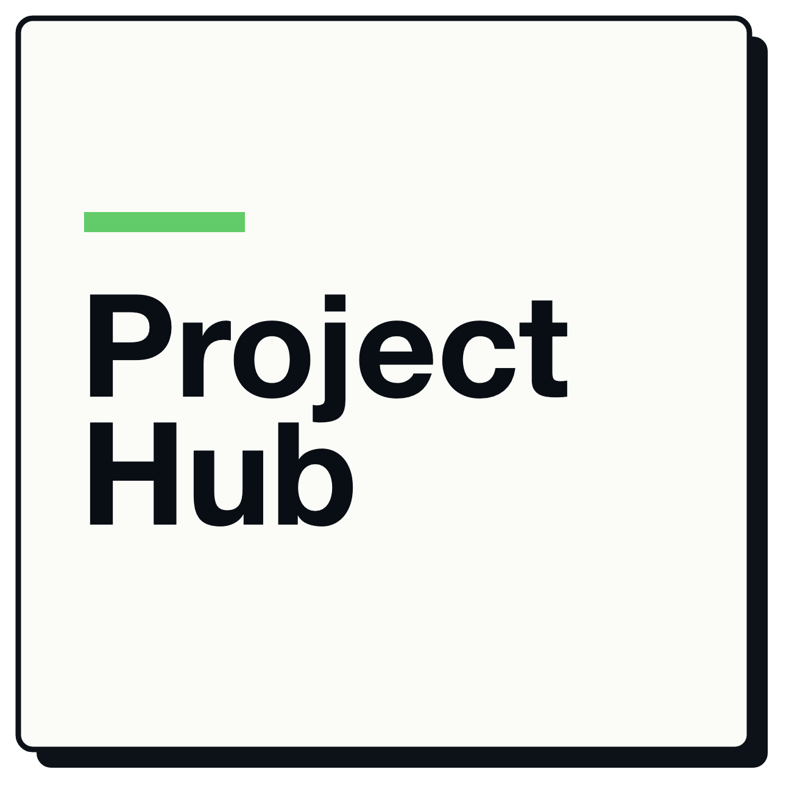
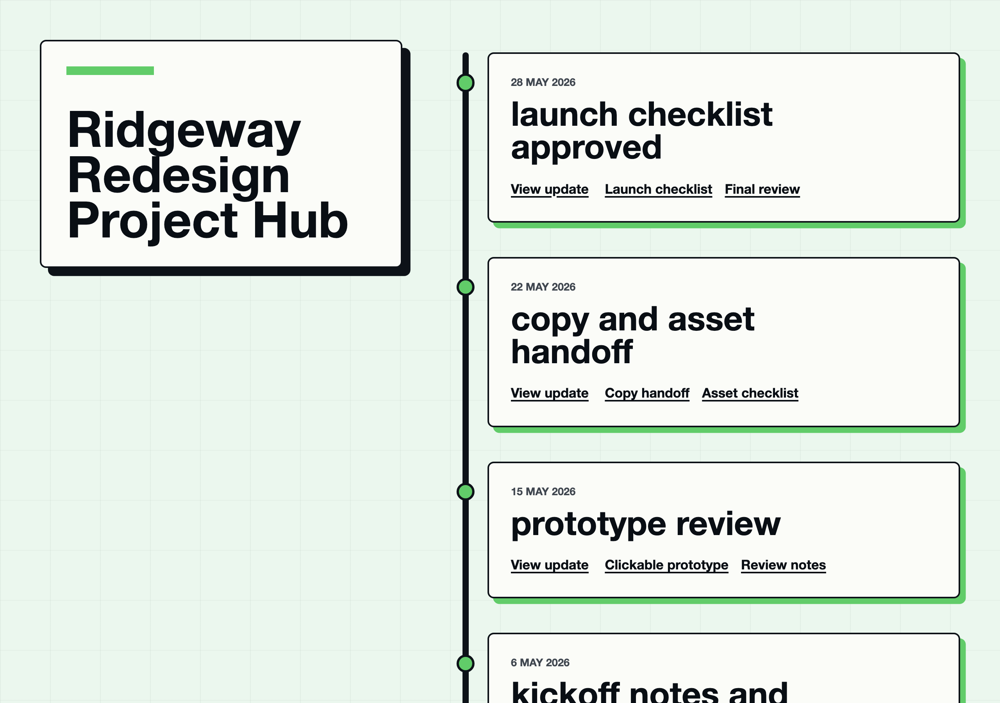
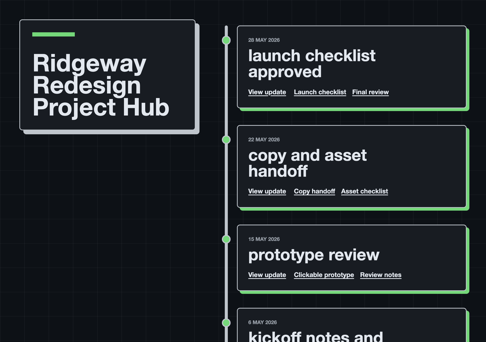

<p align="center">
  <picture>
    <source media="(prefers-color-scheme: dark)" srcset="docs/logo-dark.png">
    
  </picture>
</p>

# Hugo Project Hub

Hugo Project Hub is a reusable Hugo Module theme for publishing simple [project
hubs](https://24ways.org/2013/project-hubs/): stable project timelines with
updates, notes, and links in one browser location.

The theme is meant to be imported by a real Hugo site. Each project owns its
own content and configuration while this module provides the shared project hub
defaults and presentation layer.

## Preview

See it running at the [live demo](https://hugo-project-hub.adbr.dev).

The theme ships light and dark palettes and follows the reader's
`prefers-color-scheme` automatically.

| Light | Dark |
| --- | --- |
|  |  |

## Installation

In the consuming site's `hugo.toml`, import the module by its public path:

```toml
[module]
  [[module.imports]]
    path = "github.com/adambrett/hugo-project-hub"
```

This keeps the hub site independent of the theme repository. The consuming
site uses Hugo Modules instead of cloning a starter site or adding a nested
`themes/` directory.

## Configuration

Project Hub options live under the `[params.projectHub]` namespace:

```toml
[params.projectHub]
  dateFormat = "2 January 2006"
  footer = ""
```

`dateFormat` is the Hugo date layout used by project hub templates when showing
project dates. `footer` is optional footer text for the generated hub.

## Update Content Model

Project updates live in `content/updates/<slug>/index.md` leaf bundles. The
leaf bundle keeps longer update notes and any local files together.

Each update needs `title` and `date`. `summary` is optional, and normal Markdown
body content can be used for longer notes:

```toml
+++
title = "Prototype review"
date = "2026-05-29T10:00:00+01:00"
summary = "The prototype is ready for review."
+++
```

Artifacts use one front matter array named `artifacts`. Each artifact has a
`label` and exactly one of `url` or `resource`. `description` and `rel` are the
only optional artifact fields.

```toml
[[artifacts]]
label = "Prototype"
url = "https://example.com/prototype"
description = "Latest clickable prototype."
rel = "noopener"

[[artifacts]]
label = "Brief"
resource = "brief.pdf"
description = "Project brief stored beside this update."
```

External artifacts use `url`. Local artifacts use `resource` and should be
placed beside the update's `index.md` file. Artifacts render in the order they
appear in front matter.

## Local Development

Check the local tools required by the theme and example site:

```bash
make depend
```

Serve the example project hub locally:

```bash
make run
```

The server uses port `1313` by default. If that port is busy, set `HUGO_PORT`:

```bash
HUGO_PORT=1323 make run
```

Run the strict Hugo build for `example/`:

```bash
make test
```

Build production output into `example/public`:

```bash
make build
```

Remove generated Hugo output and caches:

```bash
make clean
```

## Requirements

- Hugo Extended `0.162.0` or newer.
- Go for Hugo Module resolution.
- Git for fetching module dependencies.

## License

Released under the [BSD 3-Clause License](LICENSE).
